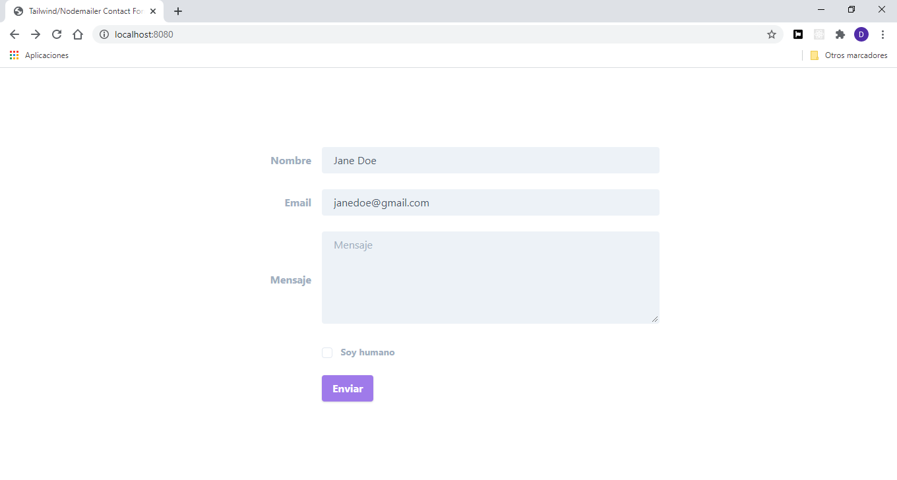

# Tailwind/Nodemailer Contact Form

Simple formulario de contactos con protección del SPAM. Se desarrolla con las siguientes fantasticas tecnologías:

* Node/Express
* Nodemailer
* Handlebars
* Tailwind

#### De la caja

* Protección del SPAM

#### Como arrancar

<pre><code>
  yarn
  yarn run app
</code></pre>

Para recibir los correos a su cuenta de Google hay que permitir el acceso de aplicaciones poco seguras:

<a href="https://myaccount.google.com/lesssecureapps" target="_blank">
  https://myaccount.google.com/lesssecureapps
</a>

También es necesario crear el fichero <code>credentials.js</code> con el siguiente contenido:

<pre><code>
  module.exports = {
    gmail: {
      user: 'su correo de Gmail',
      password: 'su contraseña de Gmail'
    }
  }
</code></pre>

#### Licensia:

Eres libre y tienes derecho de hacer todo lo que quieres.

#### Pantallas:

Formulario de contacto ->
